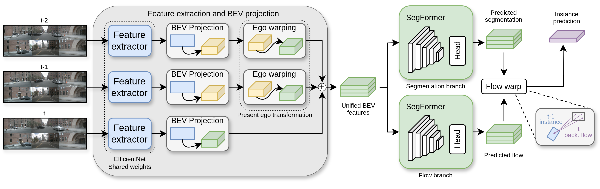

# Efficient-Instance-Prediction

[](https://github.com/miguelag99/Efficient-Instance-Prediction/blob/main/CHANGELOG.md)  

[](https://pytorch.org) [](https://lightning.ai/docs/pytorch/stable/) [](https://wandb.ai/) [](https://www.docker.com)

This repository contains the code for the paper **Fast and Efficient Transformer-based Method for Bird’s Eye View Instance Prediction** by:

- [Miguel Antunes](https://scholar.google.es/citations?user=5ZWa7pIAAAAJ&hl)
- [Luis M. Bergasa](https://scholar.google.es/citations?hl=es&user=uEBILewAAAAJ)
- [Santiago Montiel-Marín](https://scholar.google.es/citations?user=C84lnbUAAAAJ&hl)
- [Rafael Barea](https://scholar.google.es/citations?hl=es&user=IktmiSAAAAAJ)
- [Fabio Sánchez-García](https://scholar.google.es/citations?hl=es&user=2WZVFWQAAAAJ)
- [Angel Llamazares](https://scholar.google.es/citations?user=DmrsFwEAAAAJ&hl)




Change the nuscenes path in the makefile.
If WANDB KEY is not set, the code will ask for it. If you don't want to create or use your account, yo can log anonymously.

## NuScenes Dataset

Download the NuScenes dataset from the [official website](https://www.nuscenes.org/download) and extract the files in a folder with the following structure:

```bash
  nuscenes/
  └──── trainval/
        ├──── maps/
        ├──── samples/
        ├──── sweeps/
        ├──── v1.0-trainval/
        └──── v1.0-mini/
```

Configure the path to the NuScenes dataset in the Makefile:

```bash
NUSCENES_PATH = /path/to/nuscenes
```

## Pretrained Models

% Table with the models and their performance

|   Model   | VPQ short | IoU short | Params (M) | Latency (ms) | Checkpoint |
|-----------|-----------|-----------|------------|--------------|--------------|
|   Full    |    53.7   |   59.1    |   13.46    |  63          |  ['Full model ckpt'](https://universidaddealcala-my.sharepoint.com/:u:/g/personal/miguel_antunes_uah_es/ERwh_J556HhPkaqXpuBdpGoBfkVXFTVEPOE7HZ930GMA0w?e=pqkRgq)|
|   Tiny    |    52.3   |   57.5    |   7.42     |  60          |  ['Tiny model ckpt'](https://universidaddealcala-my.sharepoint.com/:u:/g/personal/miguel_antunes_uah_es/ESvQgEjJ4FJPgOCObnYYX_gB4ytg_hWDHBTsaE3SQF0s3Q?e=xaxzvf)            |

## Installation and Usage

Build the Docker image with the following command:

```bash
make build
```

You can configure the following parameters of the image in the Makefile:

- `IMAGE_NAME`: Name of the generated Docker image.
- `TAG_NAME`: Tag of the generated Docker image.
- `USER_NAME`: Name of the user inside the Docker container.

Once the image is built, you can run the container with the following command:

```bash
make run
```

This command will run a bash inside the container and mount the current directory and dataset inside the container.

Inside the container, you can:

- Evaluate the model:

  ```bash
  python val.py --checkpoint 'Path/to/model.ckpt' --dataset_root 'Path/to/nuscenes'
  ```

- Visualize the predictions:

  ```bash
  python predict.py --checkpoint 'Path/to/model.ckpt' \ 
                    --dataset_root 'Path/to/nuscenes' \
                    --save_path 'Path/to/save/predictions'
  ```

- Train the model:

  First, you can configure some training parameters in the `prediction/configs/baseline.py` file.
  We also provide the configuration files for our 4 models in the same folder.

  If you want to use your Wandb account, you can set a WANDB_API_KEY environment variable with your API key.

  The model can be trained with the following command:

  ```bash
  python train.py --config 'tiny_short/b0_short/tiny_long/b0_long'
  ```

  If you specify a checkpoint path in `baseline.py` you can:

  - Load the weights of a pre-trained model if LOAD_WEIGHTS is set to True.
  - Continue training from a checkpoint if CONTINUE_TRAINING is also set to True, which mantains the optimizer and scheduler states.

## Contact

[
](https://orcid.org/0009-0008-5627-5325)

If you have any questions, feel free to contact me at [miguel.antunes@uah.es](mailto:miguel.antunes@uah.es).
